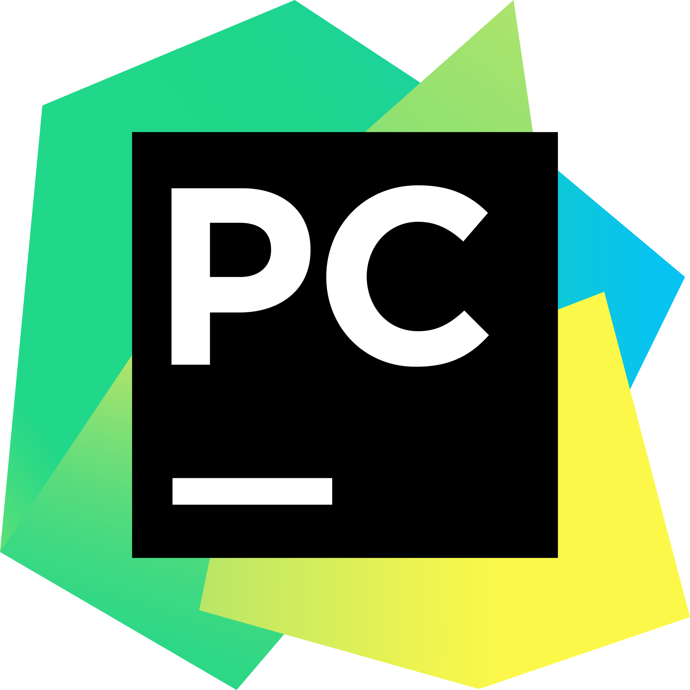

# About
-------

## What is it?

Automated Tool for Optimized Modeling (ATOM) is an open-source
Python package designed to help data scientists fasten up the
exploration phase of their machine learning projects. ATOM is a
low-code, easy-to-use library, capable of running experiments
quickly and efficiently, enabling the user to go from raw data
to generating insights in just a few lines of code. Click
[here][getting-started] to get started.

 

## What can I do with it?

ATOM is an end-to-end solution for machine learning pipelines. It supports
the user from raw data ingestion to the final results' analysis and model
deployment. Click on the icons to read more about its main functionalities.

  

    

      <a href="../user_guide/data_cleaning" draggable="false">
        
        <figcaption style="margin-top: -8px"><strong>Data cleaning</strong></figcaption>
      </a>
    

  

  

    

      <a href="../user_guide/feature_engineering" draggable="false">
          
          <figcaption style="margin-top: -8px"><strong>Feature engineering</strong></figcaption>
      </a>
    

  

  

    

      <a href="../user_guide/models" draggable="false">
        
        <figcaption style="margin-top: -8px"><strong>Model selection</strong></figcaption>
      </a>
    

  

  

    

      <a href="../user_guide/training/#hyperparameter-tuning" draggable="false">
        
        <figcaption style="margin-top: -8px"><strong>Hyperparameter tuning</strong></figcaption>
      </a>
    

  

  

    

      <a href="../user_guide/training" draggable="false">
        
        <figcaption style="margin-top: -8px"><strong>Model training</strong></figcaption>
      </a>
    

  

  

    

      <a href="../user_guide/predicting" draggable="false">
        
        <figcaption style="margin-top: -8px"><strong>Model predictions</strong></figcaption>
      </a>
    

  

  

    

      <a href="../user_guide/logging" draggable="false">
        
        <figcaption style="margin-top: -8px"><strong>Experiment logging</strong></figcaption>
      </a>
    

  

  

    

      <a href="../user_guide/plots" draggable="false">
        
        <figcaption style="margin-top: -8px"><strong>Analysis & Interpretability</strong></figcaption>
      </a>
    

  

## Who is it intended for?

* Data scientists that want to fasten up the exploration phase of their machine
  learning projects.
* Data scientists that want to run a simple modeling experiment without having
  to spend too much time on coding.
* Data scientists that are new to Python and are not (yet) familiar with all
  the relevant machine learning packages.
* Data analysts without extensive knowledge of machine learning that want to
  try out model-based solutions.
* Anyone who wants to rapidly build a Proof of Concept, for example during a hackathon.
* Anyone who is new to the field of machine learning and wants a low-code,
  easy to learn package, to get started building predictive pipelines.

 

## Support

Backtide recognizes the support from [JetBrains](http://www.jetbrains.com) by providing core project
contributors with a set of developer tools free of charge.

  [{ .icon width="200" height="200" }](https://www.jetbrains.com/community/opensource/#support)
  &nbsp;&nbsp;&nbsp;&nbsp;&nbsp;&nbsp;&nbsp;&nbsp;&nbsp;&nbsp;&nbsp;&nbsp;&nbsp;&nbsp;&nbsp;&nbsp;&nbsp;&nbsp;&nbsp;
  [{ .icon width="200" height="200" }](https://www.jetbrains.com/rustrover/)
  &nbsp;&nbsp;&nbsp;&nbsp;&nbsp;&nbsp;&nbsp;&nbsp;&nbsp;&nbsp;&nbsp;&nbsp;&nbsp;&nbsp;&nbsp;&nbsp;&nbsp;&nbsp;&nbsp;
  [{ .icon width="200" height="200" }](https://www.jetbrains.com/pycharm/)

 

## Data integrations

 

  

    

      
    

  

  

    

      
    

  

  

    

      
    

  

  

    

      
    

  

